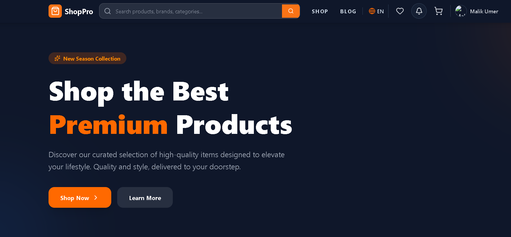
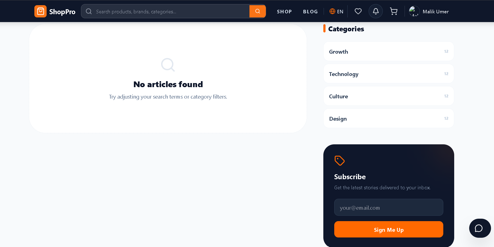
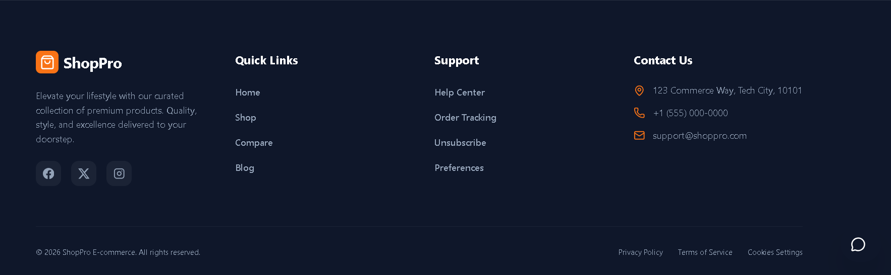
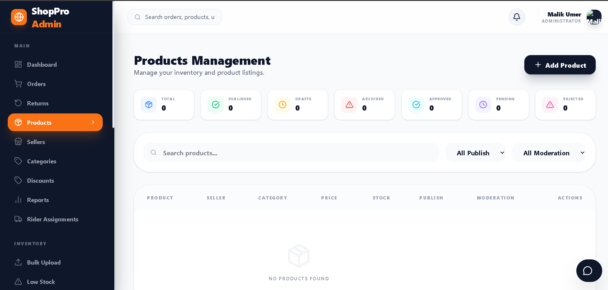

# 🛒 ShopPro — Enterprise Multi-Vendor E-Commerce Platform

> **A production-grade, enterprise-level multi-vendor e-commerce platform** built with React 19, Next.js, Node.js, Express.js, Laravel modules, Redis, and scalable software engineering architecture.
> Designed with performance optimization, modular architecture, real-time systems, role-based dashboards, advanced order lifecycle management, and enterprise engineering practices.

---

# 📸 Screenshots

| Home Page | Blog / Categories |
|:---:|:---:|
|  |  |

| Footer | Admin Dashboard |
|:---:|:---:|
|  |  |

---

# 🌟 Project Overview

ShopPro is a complete software-engineering-level e-commerce ecosystem designed to simulate real-world scalable marketplace platforms like Daraz, Amazon, and Shopify Marketplace.

The platform supports:

* Multi-vendor marketplace
* Enterprise admin management
* Seller onboarding & approval system
* Delivery rider management
* Real-time order lifecycle
* Inventory & warehouse management
* Payment workflows
* Analytics & reports
* SEO optimization
* Role-based dashboards
* Advanced security architecture
* Performance optimization
* Scalable backend engineering


---


# 🏗️ Software Engineering Upgrades Implemented

The project was upgraded from a normal full-stack application into a scalable production-ready architecture.

## ✅ Architecture Improvements

* Modular architecture
* Service layer separation
* Repository pattern
* Controller → Service → Repository flow
* Shared utility layer
* Centralized API handling
* Reusable middleware structure
* Scalable folder organization
* Improved maintainability
* Backward-compatible refactoring

---

## ⚡ Performance Optimization

* Redis-ready caching architecture
* Optimized API response handling
* Pagination optimization
* Reduced unnecessary frontend re-renders
* Query optimization
* Improved loading states
* Lazy loading support
* Better component separation
* Optimized state management

---

## 🔄 Async & Background Processing

* Queue-ready architecture
* BullMQ + Redis preparation
* Background processing structure for:

  * Emails
  * Notifications
  * Reports
  * Invoice generation
  * Analytics processing

---

## 🔐 Security Enhancements

* Protected role-based routing
* Session handling improvements
* OTP verification system
* Activity & system logs
* Validation and sanitization
* Rate limiting
* Secure authentication workflows
* Per-role access protection

---

## 🚀 DevOps & Deployment Ready

* Docker-ready structure
* CI/CD-ready architecture
* PM2 deployment support
* Production-ready environment handling
* Nginx reverse-proxy ready
* Environment separation support

---

# 👥 User Roles & Access Control

## 👑 Admin

Complete system control with enterprise dashboard access.

### Features

* Manage all users
* Approve/reject sellers
* Approve seller category requests
* Product moderation
* Order management
* Rider assignment
* Inventory management
* Warehouse management
* Coupon management
* Reports & analytics
* Marketing campaigns
* Blog management
* System logs
* Search analytics
* Role management

---

## 🏪 Seller

Dedicated marketplace seller panel.

### Features

* Seller registration approval workflow
* Seller category restriction system
* Add/Edit/Delete products
* Bulk upload products
* Product approval system
* Inventory tracking
* Revenue analytics
* Order management
* Category request system
* Real-time dashboard statistics

### Seller Category Authorization System

Sellers can ONLY add products in categories approved by admin.

Workflow:

1. Seller selects categories during registration
2. Admin approves seller
3. Seller can request new categories later
4. Admin approves category requests
5. Approved categories become available system-wide

---

## 🛒 Customer

Modern shopping experience with complete order lifecycle.

### Features

* Product browsing
* Live product search
* Cart & wishlist
* Checkout system
* Multiple shipping addresses
* Order tracking timeline
* Returns & refunds
* Reviews & ratings
* Secure authentication
* Responsive shopping UI

---

## 🚴 Delivery Rider

Dedicated delivery management panel.

### Features

* Assigned deliveries
* Delivery tracking
* Update delivery status
* Mark order as picked up
* Mark order as delivered
* Rider performance monitoring
* Admin rider detail tracking

### Rider Workflow Improvements

* Admin can view rider details via action modal
* Rider statistics visible in admin panel
* Delivered COD orders automatically update payment status to `paid`

---

# 🏪 Product Management System

## Features

* Product variants
* Multiple image uploads
* SKU generation
* Stock tracking
* Low stock alerts
* Product approval workflow
* Draft / Published / Archived status
* Product moderation
* Product analytics

---

# 🧩 Category Management System

## Advanced Category Approval Workflow

### Seller Registration Categories

Sellers select business categories during registration.

### Admin Approval System

Admin approves seller category access.

### Seller Category Restrictions

Seller CANNOT create products outside approved categories.

### Category Request System

Seller can request:

* Main category
* Subcategory
* Both together

### System-Wide Synchronization

Approved categories automatically appear in:

* Admin category list
* Seller dashboard
* Seller registration category selection
* Customer shop filters
* Frontend navigation

---

# 🛒 Cart, Wishlist & Checkout

## Cart Features

* Persistent cart
* Quantity management
* Mini-cart popup
* Cross-session persistence

## Wishlist Features

* Save products
* Move wishlist items to cart
* Share wishlist support

## Checkout Features

* Shipping calculation
* Address management
* Coupon support
* Order summary
* Payment method selection

---

# 💳 Payment System

## Supported Payments

* Cash on Delivery (COD)
* Bank Transfer
* Stripe-ready architecture

## Payment Features

* Payment tracking
* Refund handling
* COD workflow
* Automatic payment synchronization
* Order payment statuses:

  * Pending
  * Paid
  * Failed
  * Refunded

---

# 🚚 Shipping & Delivery System

## Delivery Features

* Delivery zones
* City-based shipping charges
* Estimated delivery timing
* Rider assignment
* Delivery tracking timeline
* Real-time delivery updates


---

# 📦 Inventory & Warehouse Engineering

## Features

* Real-time stock deduction
* Multi-warehouse architecture
* Warehouse stock tracking
* Low stock monitoring
* Product availability management

---

# 📊 Admin Dashboard

## Real-Time Analytics

* Total orders
* Revenue
* User growth
* Product growth
* Recent orders
* Low stock alerts
* Seller analytics
* Search analytics

---

# ⭐ Reviews & Ratings

## Features

* Verified purchase badge
* Review moderation
* Average rating calculation
* Review approval/rejection

---

# 🔍 Advanced Search & Filtering

## Features

* Live search
* Advanced filtering
* Category filters
* Price filters
* Rating filters
* Search analytics dashboard
* Search-ready scalable architecture

---

# 📩 Notification System

## Notifications

* OTP emails
* Order confirmation
* Shipping updates
* Low stock alerts
* Seller notifications
* Admin alerts

---

# 📄 Reports & Invoice System

## Features

* PDF invoice generation
* Monthly sales reports
* Seller analytics
* Product performance reports
* Revenue charts

---

# ⚙️ Advanced Engineering Features

* SEO optimization
* Sitemap generation
* Open Graph tags
* Twitter Cards
* Schema.org support
* Dark mode support
* Mobile-first responsive design
* Skeleton loaders
* Toast notification system
* Real-time architecture support

---

# 🛠️ Tech Stack

| Technology                   | Purpose                  |
| ---------------------------- | ------------------------ |
| React 19                     | Frontend UI              |
| Next.js                      | SSR & scalable frontend  |
| Tailwind CSS v4              | Styling                  |
| Redux Toolkit                | State management         |
| React Query v5               | API caching              |
| TypeScript                   | Type safety              |
| Node.js                      | Backend runtime          |
| Express.js                   | Backend APIs             |
| Laravel                      | Modular backend services |
| MongoDB / PostgreSQL / MySQL | Database                 |
| Redis                        | Caching & queues         |
| BullMQ                       | Background jobs          |
| Socket.io                    | Real-time communication  |
| Axios                        | API communication        |
| Zod                          | Validation               |
| React Hook Form              | Forms                    |
| Recharts                     | Analytics                |
| Framer Motion                | Animations               |
| Winston / Pino               | Logging                  |

---

# 📁 Scalable Project Structure

```bash
shoppro/
├── apps/
│   ├── frontend/
│   ├── backend/
│   └── admin/
├── services/
├── modules/
├── shared/
├── infrastructure/
├── queues/
├── logs/
├── docker/
├── nginx/
├── docs/
└── scripts/
```

---

# 🔐 Authentication System

## Features

* Email/password login
* Google OAuth
* OTP password reset
* Device session management
* Role-based redirects
* Session persistence
* Activity tracking

---

# 📈 Monitoring & Logging

## Features

* Centralized logs
* Activity logs
* Request logs
* Error logs
* Monitoring-ready structure
* Audit tracking

---

# 🧪 Testing Ready

## Supported

* Unit testing
* Integration testing
* API testing
* Regression-safe architecture

---

# 🚀 Deployment Ready

## Production Features

* Docker support
* PM2 support
* CI/CD ready
* Nginx reverse proxy ready
* Environment management
* Production-safe architecture

---

# 📜 Scripts

```bash
npm run dev
npm run build
npm run preview
npm run lint
```

---

# 🔗 Backend Support

Backend APIs run on:

```bash
http://localhost:8000
```

---

# 👨‍💻 Developer

## Malik Umer Khan

📧 [malik.umerkhan97@gmail.com](mailto:malik.umerkhan97@gmail.com)

---

# 🎯 Portfolio Value

This project demonstrates:

* Enterprise software engineering
* Scalable backend architecture
* Advanced frontend engineering
* Multi-vendor marketplace systems
* Role-based access control
* Real-world order lifecycle
* Performance optimization
* DevOps readiness
* Production-grade architecture
* Professional engineering standards

---

# 📌 Final Goal

ShopPro is designed to simulate a real-world scalable marketplace ecosystem with enterprise engineering standards while maintaining high performance, modular maintainability, and production-safe architecture.
